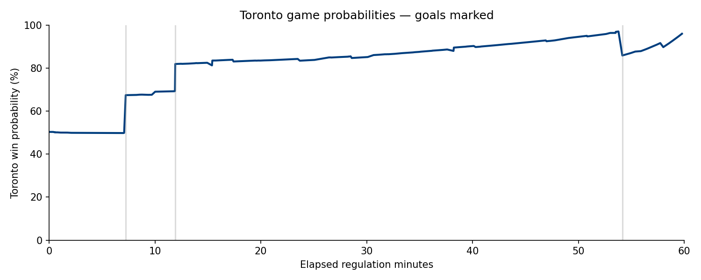
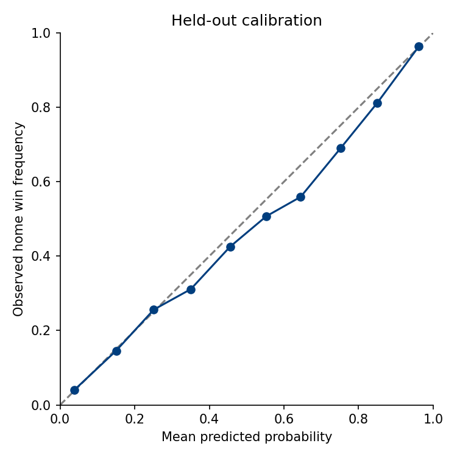
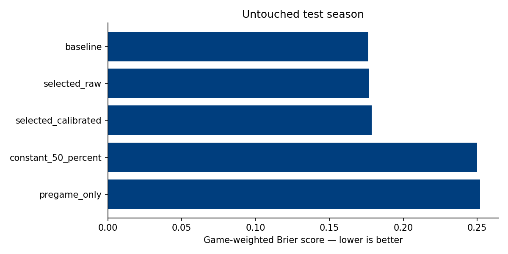
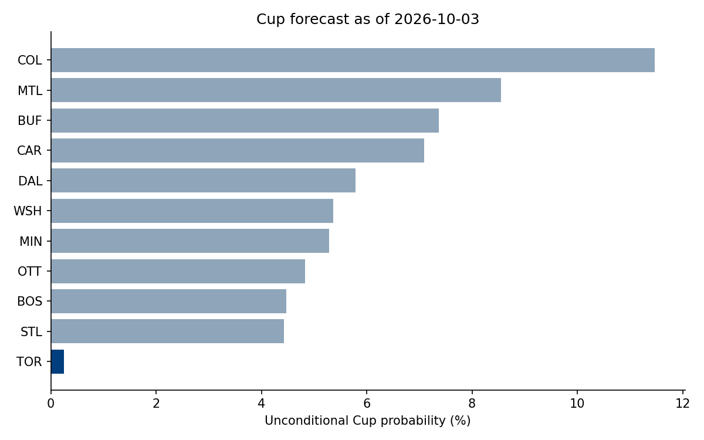

# Leafs Lab: executed results

Snapshot: 2026-10-03. Experimental model-based season forecast. The latest retrospective playoff Brier score is above the 0.25 naive baseline; these percentages are exploratory.

Toronto: playoffs **14.4%**, Final **0.6%**, Cup **0.2%**.
Cup Monte Carlo interval: 0.2%–0.4%. This interval measures simulation error only.

## Game-model validation
Selected model: logistic_C1. Untouched test season: 20252026.
Game-weighted Brier: selected/calibrated **0.1785**, score/time baseline **0.1763**.
Paired Brier-difference interval: -0.0008 to 0.0051. Improvement over baseline is not established by the bootstrap interval.

## Season-model evaluation
Retrospective preseason checks cover three seasons. Model parameters were revised after reviewing the initial fixed-strength baseline; these checks are exploratory, not a pristine untouched holdout. Details are saved in season_backtest_metrics.json and fixed_strength_baseline_backtests.json.

## Data quality
5256 parsed games; 1278937 regulation states. Last complete game date: 2026-09-30.
Situation missingness: 0.0%. See data_quality.json for season coverage and parser_errors.json for exclusions.

## Limits
- One latent team-strength draw per simulated season; SD estimated from training-season Elo drift, not a calibrated posterior. No explicit injury, lineup or trade adjustments.
- Independent Poisson regulation goals; all simulated ties resolve in overtime.
- Standings ties approximate official rules: no head-to-head tie-break.
- Playoff game probabilities use regular-season Elo; no separate playoff fit.
- Cup intervals show simulation error only, not forecasting/model uncertainty.

Sources: NHL JSON responses retained with URL, retrieval timestamp, and SHA-256. Implementation: leafslab/data.py, model.py, season.py. Exact results: metrics.json, forecast.json, game_explanation.json. The season backtest must be considered separately from game-model validation.
